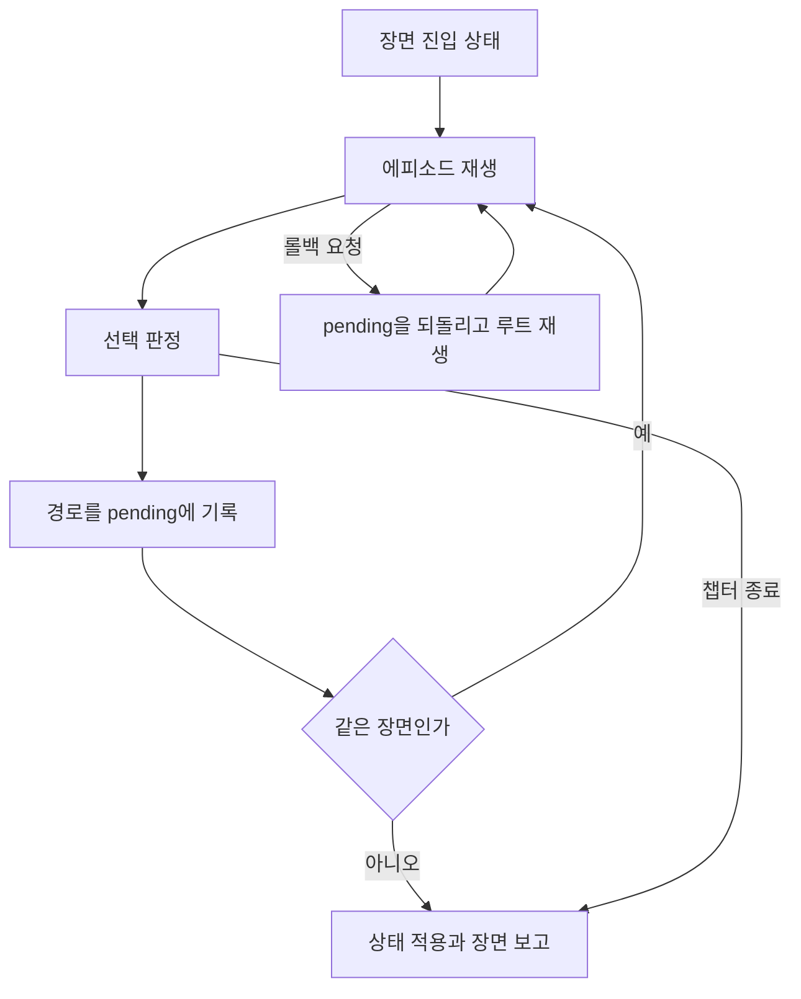

# vn-play-analytics — 실제 Unity 연동을 위한 분석과 새 PLAN

작성일: 2026-09-11  
문서 상태: 실제 원격 코드 분석에 근거한 새 계획안. 아래 U 단계는 아직 구현하지 않았다.

## 1. 이번 프로젝트의 목적

**ked-presentation-runtime에서 실제로 플레이하고, 그 진행을 Java·Spring 서버에 저장하고 다시 읽는 작은 기능부터 완성한다. 기능 하나를 연결할 때마다 Java 문법, Spring 요청 처리, JPA 저장 동작을 설명할 수 있도록 학습한다.**

첫 완성은 “실제 챕터로 새 게임 → 장면 경계의 저장 데이터를 서버에 백업 → 서버 데이터를 받아 같은 장면에서 이어하기”다. 선택 기록과 통계는 이 경험 위에 이어 붙인다.

이 문서는 두 부분으로 구성한다.

- 2~8절: 현재 코드가 무엇을 하는지, 왜 기존 PLAN과 어긋나는지 분석한다.
- 9절 이후: 그 구조에서 무엇을 유지하고, 어떤 작은 단위로 학습할지 제안한다.

이전 PLAN의 “Unity 연동 없이 독립적인 통계 서버를 완성한다”는 전제는 이번 목표로 대체한다. 다만 현재 구현한 콘텐츠 엔티티·Repository·Service·오류 처리와 학습 기록은 출발점으로 활용한다.

## 2. 분석 기준과 확인 범위

| 대상 | 기준 | 확인 결과 |
| --- | --- | --- |
| ked-presentation-runtime | `server_DB_Test` / `5ea9d8f9c5f80044a36c6f19ab2f424a1f8632eb` | 저장 v3, 수동 슬롯, 회차별 동기화·복구·정리가 반영된 기준 |
| 비교용 이전 브랜치 | `server_DB` / `362bca438bae8cb13900ffeaca9caf8362af6132` | 기준 HEAD 확인. 아래 상세 분석은 Test 브랜치 코드 기준 |
| vn-play-analytics | `dev` / `8da0d202fae6fa59a3825ceb77902f34e2285b23` | 첨부 핸드오프와 동일 HEAD |
| 첨부 자료 | `HANDOFF_vn-play-analytics_2026-09-11(1).md` | 환경·명명·학습 원칙 참고. 구현 여부는 원격 코드 우선 |

원격 트리의 잘림 없이 파일 목록을 확인했다. `Save` 21개 C# 파일(2,658줄), `Server` 5개(584줄), Unity 연결층 `Progression` 18개(1,910줄), 순수 코어 `Ked.Progression` 32개(3,014줄)를 확보했다. 주요 저장·통신·진행 호출 흐름과 모델을 상세 추적했고, 코어의 로딩·상태·분기·장면 제약 및 관련 테스트를 확인했다. 코어의 도달성 탐색은 역할과 연결 범위를 확인하는 수준이며 알고리즘 정확성 증명까지 수행한 것은 아니다.

추가로 `VNAppBootstrap`, 타이틀·세이브로드 UI 바인딩, 입력 폴러, `ScenePlaybackSession`, 실제 progression JSON 2개, 저장 수명주기 테스트와 관련 문서를 확인했다. `vn-play-analytics`의 PLAN·설정·Java 소스·테스트도 확인했다.

**검증 수준:** 정적 코드 분석이다. 이번 작업에서 Unity 실행, Java 서버 기동, DB 연동, 자동 테스트를 실행하지 않았다. 기존 테스트 코드의 존재와 커버하는 상황을 확인한 것이며 “현재 실행 통과”를 뜻하지 않는다. 사용자의 미푸시 로컬 변경과 Inspector의 현재 할당값은 확인하지 못했다. 원격 코드·브랜치에는 변경하지 않았다.

기준 링크: [Unity 기준 커밋](https://github.com/123456789qwaszx/ked-presentation-runtime/tree/5ea9d8f9c5f80044a36c6f19ab2f424a1f8632eb), [서버 기준 커밋](https://github.com/123456789qwaszx/vn-play-analytics/tree/8da0d202fae6fa59a3825ceb77902f34e2285b23).

## 3. 현재 구조를 이해하는 데 필요한 용어

| 용어 | 실제 의미 | 서버 학습에서 주의할 점 |
| --- | --- | --- |
| Chapter | progression JSON 하나가 정의하는 챕터 | 현재 Launcher는 단일 챕터 시나리오를 로드한다 |
| Episode | 그래프의 노드. 재생할 Yarn 대사 노드를 가리킨다 | 반드시 선택지가 둘 이상 있는 단위가 아니다 |
| Scene | 같은 `SceneId`로 묶인 에피소드들의 진행·롤백·저장 경계 | Unity의 `.unity` 씬이나 Episode와 동일하지 않다 |
| Progression choice | `NextOptions`의 간선 선택 | 스탯 변화·다음 Episode 이동을 담당한다 |
| Yarn choice | 대사 노드 내부의 인라인 선택 | progression 선택과 기록 형식·역할이 다르다 |
| Pending | 현재 장면 안에서 아직 확정되지 않은 경로 | 롤백·중단으로 버려질 수 있다 |
| Scene commit | pending 경로를 적용하고 장면 결과를 외부에 보고하는 것 | Spring의 DB 트랜잭션 커밋과는 별개의 경계다 |
| LocalSaveFile | 재개할 진행 상태와 지나온 장면·백로그를 담은 snapshot | 서버에는 이 객체의 JSON을 보관할 수 있다 |
| PlaythroughFile | snapshot과 미전송 기록·전송 상태를 묶은 로컬 v3 파일 | 서버 DTO와 동일한 데이터가 아니다 |
| Bookmark | 수동 세이브 슬롯에 보존한 복원 패키지 | 로드할 때 기존 회차를 되감는 대신 새 회차를 만든다 |

특히 `ChapterId`와 `EpisodeId`는 Unity에서 **문자열 콘텐츠 키**다. Java의 `Long chapterId`, `Long episodeId`에 그대로 대입하면 안 된다.

## 4. Progression 상세 분석

### 4.1 조립 지점: VNAppBootstrap

`CreateScenePlayback()`은 재생기·진행 선택 UI·Yarn 변수 브리지·SaveCoordinator를 만든다. 이어 `SceneRunner`의 `IProgressionReporter` 인자로 SaveCoordinator를 주입한다. 그 위에 Driver와 Launcher를 만든다.

`CreateSaveCoordinator()`는 다음 분기를 가진다.

- `serverBaseUrl`이 비면 `LocalFileSaveStore`와 서버가 없는 SaveCoordinator를 만든다.
- 값이 있으면 `ServerApi → GuestSession / ChapterVersionResolver → SaveSyncTransport → ServerSyncSaveStore`를 만들고 북마크 동기화·서버 복구도 함께 연결한다.

`Start()`는 초기 동기화를 시작하고 `Update()`는 `TickSync()`를 호출한다. 따라서 **서버 URL만 vn-play-analytics 주소로 바꾸는 것은 부분 기능 연결이 아니다. 기존 계약 전체를 향한 요청이 시작된다.**

새 학습 연결은 이 조립 지점에서 분리하는 것이 가장 작다. 진행 코어에 HTTP 코드를 넣을 필요가 없다.

### 4.2 ProgressionLauncher: 시작·이어하기·전환

| 메서드 | 실제 책임 |
| --- | --- |
| `LaunchCoreAsync` | JSON 로드, Yarn 노드 존재 확인, 재개 상태 검증, Driver 실행 |
| `TransitionAsync` | 현재 재생 중단 → 로컬 전환 준비 → 다음 재생 |
| `ResumeAfterAsync` | 초기 복구를 기다리되 그 사이 다른 전환을 선택했으면 오래된 요청 취소 |
| `TransitionAfterAsync` | 원격 슬롯 본문을 먼저 받은 뒤 전환. 다운로드 중 더 최신 선택이 생기면 무효화 |
| `StopAsync` | Driver 취소와 실제 실행 Task 종료를 기다림 |
| `ExitAsync` | 현재 진행을 중단하고 대기 중이던 옛 전환을 무효화 |

저장된 챕터·에피소드가 없거나 장면 루트가 아니거나 완료된 챕터라면 재개를 수락하지 않는다. 저장값을 아무 Episode에 적용하는 방식으로 서버 이어하기를 구현하면 이 규칙과 충돌한다.

주의: `LaunchAsync`와 `TransitionAsync`의 Task는 회차 생성 응답만 기다리는 Task가 아니다. 재생 실행 수명까지 이어진다. “새 게임 등록”을 이 Task의 완료 뒤에 붙이면 챕터 재생이 끝난 뒤 등록될 수 있다. 등록 관찰 지점은 첫 `ReportSceneEntered` 뒤의 로컬 회차다.

### 4.3 ProgressionDriver: 챕터 실행 수명

Driver는 현재 챕터·확정 상태·진행 중인 SceneRunContext·CancellationTokenSource를 소유한다.

1. 실행 시작 시 백로그를 복원한다.
2. 챕터 Yarn 선언값을 초기화하고 저장된 Yarn 변수를 덮는다.
3. 확정 상태로 새 SceneRunContext를 만든다.
4. SceneRunner가 장면을 끝내면 반환된 상태를 채택한다.
5. `SceneEnded`면 다음 장면을 실행하고 `ChapterEnded`면 종료한다.
6. 취소·오류·정상 종료 후 실행 중 상태를 정리한다.

`PendingPath`는 현재 장면의 미확정 경로를 수동 슬롯 등에 제공하는 값이다. 서버에서 이미 확정된 플레이 기록으로 취급하면 안 된다.

### 4.4 SceneRunner: 장면 안의 진행과 확정



장면 시작에는 `ReportSceneEntered`가 호출된다. 각 에피소드 대사가 끝나면 이벤트 대상 시청 기록을 남기고 다음 선택을 계산한다. 현재 작업 상태는 `EntryState.FoldChoices(pending)`으로 계산한다.

선택에는 세 종류가 있다.

- `User`: 사용자가 화면에서 고른 간선.
- `AutoAdvance`: 콘텐츠의 자동 간선.
- `Recorded`: 로드·롤백 재생 중 이미 저장된 경로를 소비한 것.

새 선택은 pending에 추가한다. Recorded 선택을 다시 추가하지는 않는다. Via 노드가 있으면 이를 재생한 뒤 목적 Episode로 이동한다. 장면이 바뀌거나 챕터가 끝날 때 `CommitScene`이 경로를 접고, 진행 상태·Yarn 변수·백로그·선택·이벤트를 한 번에 보고한다.

정상 장면 실행에서는 커밋 보고가 최대 한 번이다. 하지만 이 사실이 네트워크 요청의 중복 없는 저장을 보장하지는 않는다. 중단·오류 흐름이 커밋 없이 빠져나가는 경우 pending은 서버 기록이 되어서는 안 된다.

### 4.5 롤백과 장면 밖 과거 로드

현재 장면 롤백은 `ScenePendingHistory.RewindAfter`가 표적 뒤 경로와 시청 기록을 잘라내고, 루트부터 자동 응답하며 재생하는 방식이다. 아직 확정하지 않은 선택을 수정하는 것이다.

반면 완료된 과거 장면이나 수동 슬롯으로 이동하면 SaveCoordinator가 새 Playthrough를 만든다. 두 경우를 같은 “선택 취소 API”로 묶으면 서버가 해결해야 할 일이 급격히 커진다. 초기 서버 학습에서는 **현재 장면 롤백은 유지하고, 과거 회차 포크 연동은 보류**하는 것이 자연스럽다.

### 4.6 순수 코어 Ked.Progression

| 영역 | 주요 타입 | 책임 |
| --- | --- | --- |
| 입력 | Loading DTO, `ProgressionLoader` | 저작 JSON의 표현을 런타임 모델로 변환하고 잘못된 입력 진단 |
| 정의 | `ChapterProgression`, `EpisodeNode`, `EpisodeOption` | 챕터 그래프·간선·장면 관계 |
| 제약 | `ChapterInvariants`, `ScenarioInvariants` | 키 중복, 시작·목적 노드, 스탯·조건, 장면 진입 규칙 등 |
| 상태 | `ProgressionState` | 선택 순서대로 스탯을 변경하고 새 상태 반환 |
| 판정 | `ChapterTransition`, `ConditionEvaluator`, `ResolvedOption` | 표시·잠금·자동 이동·종료 판정 |
| 분석 | `ChapterReachability` | 가능한 상태를 탐색하는 콘텐츠 도달성 분석 |

`ProgressionState`는 변경한 딕셔너리 사본으로 새 상태를 만든다. 간선이 현재 노드의 실제 outgoing edge인지 확인하고 스탯 범위를 적용한다. 이 게임 규칙을 Spring에서 다시 구현할 필요는 초기에는 없다.

자동 간선은 유일한 간선이고, 표시·선택 조건 및 스탯 변화가 없으며, 같은 장면 안으로 이동해야 한다. `ChapterEnded`는 단순히 `NextOptions.Count == 0`뿐 아니라 고를 수 있는 간선이 없는 경우에도 나올 수 있다. 따라서 이를 곧바로 작가가 정한 “정상 엔딩 달성”으로 부르지 않는다.

### 4.7 실제 샘플에서 보이는 차이

`qwer_scene.progression.json`은 다음 구조다.

| Episode | Scene | 진행 |
| --- | --- | --- |
| EP01 | 사무실 | EP02_01 또는 EP02_02 선택 |
| EP02_01 | 사무실 | 선택지 하나로 EP03 이동 |
| EP02_02 | 사무실 | Via를 거쳐 EP03 이동 |
| EP03 | 복도 | Auto로 EP04 이동 |
| EP04 | 복도 | 선택지 없음, 챕터 종료 |

성실 루트라면 첫 장면 보고에는 `EP01[0]`, `EP02_01[0]` 두 간선이 들어가고 재개 Episode는 `EP03`이다. 복도 종료 보고에는 자동 간선 `EP03[0]`이 들어가며 `ChapterCompleted=true`다.

이 샘플의 EventKey는 모두 비어 있다. 따라서 `WatchedEpisodeIds`가 비어 있는 것은 정상이다. EP04처럼 진행 선택이 없는 노드는 선택 기록만으로 방문 여부를 복원할 수 없다.

## 5. Save 상세 분석

### 5.1 SaveCoordinator가 맡는 것

| 파일 | 역할 |
| --- | --- |
| `SaveCoordinator.cs` | 현재 회차 ID, 세션, 장면 목록, 플레이 시간, 선택한 회차로 전환 |
| `.Playthrough.cs` | 새 게임 예약, 로컬 이어하기 데이터 제공 |
| `.Reporting.cs` | 장면 진입 초기 저장, 장면 결과를 snapshot과 미전송 기록으로 변환 |
| `.Bookmarks.cs` | 수동 슬롯 생성·덮어쓰기·이름 변경·삭제·복제 |
| `.Fork.cs` | 백로그 좌표 해석, 과거 장면·수동 슬롯 기반 새 회차 |
| `.Sync.cs` | 초기 복구, 유지보수·재시도·정리, 충돌 포크 후 활성 회차 연결 |

이 클래스는 저장 직렬화만 하는 클래스가 아니다. 진행 보고, 회차 수명, 수동 슬롯, 복원, 서버 작업을 조정한다. 초반 학습에서 Java로 그대로 번역할 대상이 아니다.

### 5.2 새 게임의 실제 생성 시점

`PrepareNewPlaythroughAsync`는 네트워크를 기다리지 않는다. 새 ID를 예약하고 `_newPrepared`를 세운다. 첫 `ReportSceneEntered`에서 초기 LocalSaveFile을 먼저 만들고 `SetActive`한다.

따라서 “새 게임 버튼 클릭”과 “초기 저장 가능한 회차가 실제 생성됨”은 다른 순간이다. 콘텐츠 사전 검사가 실패해 첫 장면에 들어가지 못했다면 서버 회차도 만들지 않는 쪽이 이번 학습 의미에 맞는다.

예전 문서의 `FlushAsync → 새 회차` 흐름은 이 기준 코드에 맞지 않는다. 현재 작업은 회차 ID가 고정된 세션을 사용하므로 과거 전송 때문에 새 게임 전환을 기다리지 않는다.

### 5.3 장면 확정의 로컬 저장

`ReportSceneCommitted`는 다음을 구성한다.

1. 장면 진입 체크포인트 + 경로 + Yarn 선택 + 백로그 범위로 SceneRecord 작성.
2. 다음 장면 진입 상태 또는 챕터 완료 상태로 LocalSaveFile 작성.
3. progression 선택을 PendingChoice, 이벤트 대상 시청을 PendingEvent로 변환.
4. `_active.Commit(snapshot, choices, events)` 호출.
5. 쓰기 성공 뒤 메모리 장면 이력을 갱신하고 현재 진입 체크포인트 해제.
6. 서버가 있으면 해당 회차 ID의 동기화 요청.

`ChosenAt`은 현재 구현에서 클릭 순간이 아니라 **장면 커밋에서 만든 동일 시각**이다. 이를 클릭 시각이라고 통계에 표시하지 않는다.

### 5.4 파일과 객체의 역할

| 파일·객체 | 내용 | 초기 학습에서의 사용 |
| --- | --- | --- |
| `active.json` | 활성 회차·선택 scope·선택 버전 | 기존 로컬 저장기가 관리 |
| `playthroughs-v3/{id}.json` | PlaythroughFile 전체 | 기존 로컬 저장기가 관리 |
| `PlaythroughFile.Snapshot` | LocalSaveFile | 초기 서버 백업의 재료 |
| `PlaythroughFile.Sync` | 서버 ID, revision, pending, retry 상태 | 학습 서버의 상태로 재사용하지 않음 |
| `PlaythroughFile.InFlight` | 재전송해야 할 고정 요청 사본 | 기존 완전 동기화 계약용 |
| `bookmarks.json` | 수동 슬롯 요약·삭제 기록 | 기존 로컬 기능 유지 가능 |
| `bookmark-snapshots/{key}.json` | 슬롯별 복원 본문 | 초기 서버 범위 밖 |
| `restore-progress.json` | 복구 시작·이어하기·목록 진척 | 기존 서버 복구 계약용 |
| `conflict-transfer.json` | 회차 포크 이동의 재실행 기록 | 초기 서버 범위 밖 |
| `playthrough-catalog.json` | 회차 요약 파생 캐시 | 서버 정규화 모델의 원본으로 삼지 않음 |

### 5.5 PlaythroughSession의 안전성 경계

세션은 회차 ID와 파일 경로가 고정된다. `Update`는 **사본 수정 → 파일 교체 → 메모리 채택** 순서다. `Commit`은 snapshot 변경, commit version 증가, choice seq 발급, pending 추가를 한 파일 쓰기로 묶는다.

`CaptureSyncWork`는 전송할 snapshot과 pending을 고정하고 파일에 남긴다. 실패·재시작 이후에도 새 상태와 섞지 않고 같은 요청을 보낼 재료다. `Acknowledge`는 해당 work ID를 확인한 뒤 전송했던 접두부만 지운다. 네트워크 대기 중 추가된 후속 커밋을 지우지 않는다.

이것이 이전 큐와 현재 v3를 구분하는 핵심이다. **학습용 서버가 일부 데이터만 받았는데 기존 `Acknowledge`를 호출하면, 전체 저장 동기화가 완료된 것처럼 처리된다. 그러면 안 된다.**

### 5.6 수동 슬롯과 포크

수동 슬롯은 checkpoint, 당시 pending 경로, Yarn 인라인 선택, 목표 라인, 이전 백로그, 완료된 장면 이력을 가진다. 슬롯 덮어쓰기는 ID를 유지하고 LocalVersion을 증가시킨다. 새 본문을 확보한 다음 요약 인덱스를 교체한다.

`ForkFromBookmark`는 이 복원 패키지로 새 회차 파일을 만든다. `ForkFromScene`은 해당 장면 이전의 이력을 계승하고, 필요하면 표적 라인까지 재생할 계획을 넣는다. 원래 슬롯 자체는 로드로 변경되지 않는다.

`InheritedPlaySeconds`와 `OwnPlaySeconds`는 계승 시간과 새 회차에서 흐른 시간을 구분한다. 초기 학습에서 포크를 연결하지 않는다면 이 통계 모델까지 만들 이유는 없다.

### 5.7 보존·정리

`CollectUnusedPlaythroughs`는 활성 회차와 수동 슬롯 출처를 보존한다. 전송 중·충돌·차단·진행 중 이동도 보존한다. 서버 동기화가 켜져 있으면 미전송 상태를 정리하지 않는다. 수동 슬롯은 날짜·개수 기준으로 자동 만료시키지 않는다.

서버가 없는 모드에서는 정리 조건에 `requireSynced=false`가 들어간다. 따라서 나중에 학습용 자동 재전송을 만들 때 “서버가 없는 SaveCoordinator + 별도 백그라운드 전송기”만 붙이면 충분하지 않다. 새 게임 뒤 과거 회차가 정리되어 별도 전송기가 읽을 파일을 잃을 수 있다. 이 문제는 자동화 단계의 필수 검토 대상이다.

## 6. Server와 Save/Sync 상세 분석

### 6.1 통신층과 정책층

| 구성 | 책임 |
| --- | --- |
| `ServerApi` | UnityWebRequest, UTF-8 JSON, HTTP 헤더·타임아웃, 응답 파싱 |
| `ApiResult<T>` | 통신 실패 / HTTP 실패 / 성공의 구분과 본문 |
| `GuestSession` | 게스트 가입·로그인·토큰 저장·만료 임박 갱신·401 한 번 재시도 |
| `ChapterVersionResolver` | 실제 TextAsset 바이트 SHA-256과 서버 버전 checksum 대조 |
| `SaveSyncTransport` | snapshot·SyncWork를 기존 서버 계약 DTO로 변환 |
| `ServerSyncSaveStore` | 회차 ID별 순차 전송, 실패 격리, 충돌 포크, 이어하기 포인터 게시 |
| `ServerBookmarkSync` | 슬롯 ID별 PUT/DELETE 직렬화, 오래된 응답 방지 |
| `ServerRestore` | 이어하기 하나, 슬롯 요약 페이지, 선택한 슬롯 본문 복구 |

`ServerApi.SendAsync`는 현재 private이다. 새 API를 쓰려면 공개 요청 메서드를 추가하거나 별도 학습용 API 클래스를 만들어야 한다. 외부에서 기존 private 제네릭 메서드를 호출할 수 있는 것으로 계획하면 안 된다.

`SaveJson`은 필드명을 camelCase로 바꾸되 딕셔너리 키는 보존한다. 로컬 파일과 기존 서버가 함께 쓰는 규칙이므로 새 학습 DTO 때문에 전역 설정을 바꾸지 않는다.

### 6.2 기존 업로드 한 번에 필요한 흐름

1. 로컬 세션에서 고정 SyncWork를 확보한다.
2. 서버 회차 ID가 없으면 게스트 인증을 거쳐 회차를 생성한다.
3. 해당 작업의 콘텐츠 버전이 없으면 checksum으로 조회한다.
4. `PUT /playthroughs/{id}/saves/1`에 snapshot·choices·events·시간·revision을 보낸다.
5. 성공하면 전송한 작업만 ACK한다.
6. `CONFLICT` 오류면 원래 회차를 포크하거나, 신규 revision 0 충돌에서는 무한 포크를 막고 중단한다.
7. 그 밖의 일시 오류는 지수 backoff, 대부분의 나머지 4xx는 명시적 재시도 전까지 차단한다.
8. 동기화된 활성 회차를 이어하기 대상으로 별도 게시한다.

하나의 실패한 회차가 다른 회차의 동기화를 막지 않도록 이번 drain에서 실패한 ID를 관리한다. 요청 도중 A에서 B로 새 게임을 시작해도 A 응답은 A 세션에만 적용한다.

### 6.3 기존 서버 API 계약과 초기 채택 여부

| 기존 경로 | 역할 | 초기 계획 |
| --- | --- | --- |
| POST `/users`, POST `/auth/login` | 계정·토큰 | 보류 |
| GET `/content/chapters/{key}/versions` | 바이트 checksum 버전 매칭 | 고정 학습 콘텐츠로 대체 |
| POST `/users/{id}/playthroughs` | 로컬 GUID와 서버 ID 대응·포크 출처 | 학습용 회차 API로 축소 |
| PUT `/playthroughs/{id}/saves/1` | snapshot·기록·revision 동기화 | 장면 checkpoint 백업 API로 축소 |
| PUT/GET `/users/{id}/resume` | 사용자 이어하기 포인터와 복구 | 명시적으로 고른 학습 회차 복구부터 |
| GET `/users/{id}/playthroughs` | 전체 회차 요약 | 이후 학습 서버 자체 목록 |
| GET `/playthroughs/{id}/saves/1` | 저장 본문 조회 | 학습 checkpoint 조회로 축소 |
| GET `/playthroughs/{id}/saves/1/choices` | 저장 선택 기록 조회 | 이후 관계형 선택 조회로 학습 |
| PUT/DELETE `/users/{id}/bookmarks/{key}` | 버전이 있는 수동 슬롯 동기화 | 보류 |
| GET 북마크 목록·페이지·단건 | 선택적 복구 | 보류 |

여기서 “대체”는 기존 ServerSyncSaveStore와 호환된다는 의미가 아니다. 학습 모드에서 별도 클라이언트 어댑터와 별도 계약을 사용한다는 뜻이다.

### 6.4 복구는 전체 다운로드가 아니다

ServerRestore는 기존 로컬 회차가 없는 환경에서 복구를 시작한다. 진행 상태를 저장하여 목록 복구를 재개한다. 이어하기 snapshot 하나를 먼저 받고, 슬롯은 요약만 페이지로 가져오며 본문은 선택 시에 받는다.

네트워크 대기 중 사용자가 새 게임을 선택했다면 뒤늦은 복구가 활성 회차를 덮지 못한다. 삭제된 슬롯을 되살리지 않고, 다운로드 중 수정된 슬롯을 오래된 본문으로 덮지 않는다.

이 계약은 장점이 있지만 HTTP·JPA를 처음 연결하는 단계에서는 배울 개념이 너무 많다. 초기에는 “선택한 회차의 checkpoint 하나를 비어 있는 학습 저장 경로에 복구”하는 명시적 동작으로 줄인다.

## 7. vn-play-analytics 현재 상태와 기존 PLAN의 부적합 지점

### 7.1 실제로 구현된 것

Chapter·Episode·ChoiceOption, 세 Repository, `ContentService.createChapter`, `POST /chapters`, 입력·중복 검증, ErrorCode·ErrorResponse·GlobalExceptionHandler가 있다. DTO는 record이고 오류 응답은 `{errorCode, message}`다.

**아직 없는 것:** 콘텐츠 GET 목록·상세 API, 회차 엔티티/API, 저장 API, 선택 기록, 통계, 기능 통합 테스트. 테스트 파일에는 `contextLoads()` 하나가 있다. 따라서 기존 M1 전체를 완료로 표시하지 않는다.

환경은 Java 21, Spring Boot 4.1.1, MySQL 3308의 `vn_analytics`, 테스트 `vn_analytics_test`다. 현재 개발 JPA 설정은 `ddl-auto=update`, SQL 출력, `open-in-view=false`다. 이 환경을 다시 만드는 단계부터 반복하지 않는다.

### 7.2 구체적인 불일치

| 현재 전제·구현 | 실제 런타임 | 새 계획에서의 처리 |
| --- | --- | --- |
| Episode를 선택 발생 장면으로 간주 | Scene 안에 여러 Episode가 존재 | Episode와 Scene 용어 구분 |
| `options @Size(min=2)` | 0개·1개 노드도 정상 | 빈 리스트 허용, null은 거부 |
| 모든 옵션 label이 필수 문자열 | Auto 간선은 빈 label 가능 | `auto` 필드와 조건부 label 검증 |
| 원시 선택 POST를 반복하면 계속 행 추가 | 장면 롤백·재실행·재전송이 있다 | 확정 경로만 받고 반복 업로드의 의미 명시 |
| 서버 optionId 한 개로 수집 | 런타임은 콘텐츠 키 + 원본 순번 보유 | 서버에서 키를 FK로 해석 |
| 통계를 먼저 완성, Unity 연결은 나중 | 사용자는 실제 기능을 쓰며 학습 희망 | 초기 단계마다 Unity에서 결과 확인 |
| 세이브/이어하기는 제외 | Save·Progression을 실제 활용하려는 목표 | 장면 checkpoint 백업·복구를 첫 완성으로 |
| 원래 오류 DTO의 `Code` | 새 서버는 `errorCode` | 학습 API 응답 DTO를 별도로 맞춤 |

`qwer.progression.json`에는 빈 Episode Title도 있다. 첫 실습은 제목이 있는 `qwer_scene`을 사용한다. 콘텐츠 전체를 가져오는 후속 작업에서는 빈 제목을 키로 표시하는 등 표시 정책을 명시하고, 의미를 모르는 값을 임의로 채우지 않는다.

### 7.3 유지할 학습 자산

명시적 생성자 주입, record DTO, 일반 클래스 Entity, protected 기본 생성자, 자식→부모 단방향 LAZY ManyToOne, 이름 있는 FK·UNIQUE, Service 트랜잭션, `errorCode` 명칭은 유지한다. Lombok·범용 매퍼·불필요한 인터페이스를 초기 필수로 추가하지 않는다.

지역 변수는 문맥이 짧고 명확하면 `chapter`, `episode`, `option`을 쓴다. 타입과 역할이 다른 식별자는 `chapterId`, `chapterKey`, `clientPlaythroughId`처럼 구분한다. 새로운 기능마다 이름 규칙을 다시 바꾸지 않는다.

## 8. 연결 방식의 선택

| 방식 | 얻는 것 | 학습 부담 | 판단 |
| --- | --- | --- | --- |
| 기존 서버 계약 전체 구현 | 기존 동기화 스택 그대로 사용 | 인증·버전·revision·복구·포크가 동시에 필요 | 후속 과정 |
| 장면 확정 보고와 로컬 snapshot을 활용하는 작은 어댑터 | 실제 게임·저장 구조를 사용하면서 필요한 API만 연결 | 작은 클라이언트 연결 코드 + 단계별 서버 기능 | **권장** |
| 선택 버튼에서 HTTP를 바로 호출 | 가장 빠른 요청 실험 | pending·롤백 의미와 어긋나 최종 구조로 쓰기 어려움 | 본 계획의 수집 지점으로 사용하지 않음 |

**핵심 선택:** 기존 로컬 SaveCoordinator는 계속 사용한다. 학습용 Reporter가 로컬 저장 호출을 먼저 수행하고, 성공한 뒤 확정 snapshot을 학습용 연결에 제공한다. 기존 완전 동기화 전송기를 일부만 흉내 내지 않는다.

## 9. 초기 기능 제한

| 기능 | 초기 U0~U4 | 후속 |
| --- | --- | --- |
| 대사·연출·진행 스탯·장면 내부 롤백 | 기존 런타임 사용 | 유지 |
| 콘텐츠 | 고정한 qwer_scene 챕터 한 개 | 다른 고정 챕터·조건부 옵션 실습 |
| 실행 환경 | 한 기기·한 실행 인스턴스·개발자 한 명 | 다중 사용자·기기는 별도 단계 |
| 로컬 자동 저장·로컬 이어하기 | 사용 | 유지 |
| 서버 저장 | 사용자가 명시적으로 보내는 최신 장면 checkpoint | 자동 업로드·재시도는 별도 단계 |
| 서버 복구 | 선택한 회차 하나를 빈 학습 저장 환경에 복구 | 기존 로컬과 충돌 해결은 보류 |
| 수동 슬롯·과거 장면 포크 | 학습 실행 경로에서는 비활성화 | 학습 서버가 지원할 때 개방 |
| 인증·JWT·버전 checksum | 보류 | 필요를 직접 경험한 뒤 |
| 선택 통계 | U5~U6 | 실제 확정 기록을 이용 |
| 이벤트 도달률·앨범 연동 | 보류 | EventKey 계약부터 별도 설계 |

학습 전용 저장 루트(예: `saves-learning`)와 API 설정을 둔다. 기존 `saves`와 `account.json`을 학습 초기화에 사용하지 않는다. 시작 버튼·이어하기는 실제 UI를 사용하되 서버 전송·복구는 작은 학습 패널 또는 명시적인 개발용 동작으로 시작한다.

완료된 과거 장면 포크와 수동 슬롯 로드는 UI뿐 아니라 입력 폴러·백로그 액션에서도 막아야 한다. 어댑터가 `ForkedFrom != null`인 회차를 발견하면 학습 업로드를 거부해 서버가 지원하지 않는 회차가 조용히 섞이지 않도록 한다. 기존 일반 플레이 모드의 기능을 삭제하는 것은 아니다.

## 10. Unity 연결 지점 설계

다음 클래스 이름은 제안이며 아직 존재하지 않는다.

| 제안 구성 | 필요한 이유 | 책임 제한 |
| --- | --- | --- |
| `LearningProgressionReporter : IProgressionReporter` | 실제 장면 보고와 로컬 저장 성공을 관찰 | SaveCoordinator에 먼저 위임한 후 학습 연결에 알림 |
| `AnalyticsApi` | 새 서버의 작은 HTTP 계약 | 필요한 메서드만 하나씩 추가. 토큰·기존 저장 API를 호출하지 않음 |
| `LearningSession` | 로컬 GUID와 서버 회차 ID, 요청 중 상태 보관 | 최신 활성 회차를 응답 도착 후 다시 추측하지 않음 |
| 학습용 저장·복구 동작 | 업로드와 복구 결과를 직접 관찰 | 최초에는 한 요청만 실행하고 결과를 표시 |

초기 reporter의 흐름은 아래 정도면 충분하다.

```text
ReportSceneEntered(report)
  → SaveCoordinator.ReportSceneEntered(report)
  → 성공한 실제 로컬 회차 ID와 snapshot 관찰

ReportSceneCommitted(report)
  → SaveCoordinator.ReportSceneCommitted(report)
  → 성공한 해당 회차 snapshot의 사본 확보
  → 학습 패널에 서버로 보낼 확정 지점 표시
```

`IProgressionReporter`는 void 메서드다. 여기에 네트워크 await를 억지로 숨기거나 async void를 추가하지 않는다. 초기에는 보고가 HTTP를 직접 발사하지 않고 로컬 결과를 관찰한다. 회차 등록과 저장은 명시적 Task 메서드로 호출하여 실패를 관찰한다.

새 게임 등록의 자동 연결이 필요할 때는 최초 진입에서 확보한 ID를 LearningSession에 전달하고, 예외를 처리하는 등록 작업을 추적한다. 등록을 기다려야 하는 것은 서버 저장 동작이며, 대사 재생 전체를 서버 대기에 묶지 않는다.

장면 보고 직후 `ILocalSaveStore.LoadPlaythrough(capturedId)`로 저장된 사본을 읽는다. 어댑터에 같은 localStore 인스턴스를 명시적으로 주입하면 SaveCoordinator의 private 필드를 노출할 필요가 없다. 참조를 보관한 채 나중에 현재 활성 회차를 다시 읽어서 A 요청을 B 데이터로 바꾸지 않는다.

기존 `PlaythroughFile.Sync`의 서버 ID·revision·ACK는 학습용 연결에서 수정하지 않는다. 학습 서버가 받은 것은 완전 동기화 계약을 충족한 것이 아니기 때문이다.

## 11. 새 마일스톤 개요

기존 M0~M6와 혼동하지 않도록 새 계획은 U0부터 번호를 매긴다.

| 단계 | 실제로 확인하는 결과 | Java 학습 | Spring/JPA 학습 |
| --- | --- | --- | --- |
| U0 | 실제 장면 보고와 로컬 재개 위치를 설명 | DTO·ID 의미 비교 | 요청 전 데이터 경계 이해 |
| U1 | Unity가 현재 챕터의 서버 등록 정보를 조회 | record, List, Set, 반복문, null | GET·POST, Validation, DTO, 관계 조회 |
| U2 | 실제 새 게임 GUID와 DB 회차 연결 | 생성자, Optional, 예외, 식별자 | DI, Service, FK·UNIQUE, 생성 응답 |
| U3 | 장면 checkpoint를 서버에 저장하고 조회 | String/객체, 직렬화, 시간, 메서드 | PUT·GET, Entity 변경 감지, 트랜잭션 |
| U4 | 서버에서 받은 snapshot으로 Unity 이어하기 | 역직렬화, Map, 값 검증 | 없음/존재 구분, 복원 응답 계약 |
| U5 | 실제 확정 선택을 관계형 데이터로 조회 | List 순서, 반복문, DTO 변환 | 여러 Repository를 묶는 트랜잭션 |
| U6 | 실제 선택 비율을 Unity에서 확인 | 집계 결과·비율 계산 | SQL·JPQL·LEFT JOIN·projection |
| U7 | 필요한 경우 자동 저장·재전송으로 확장 | 비동기 수명·불변 요청 | 중복·순서·버전·DB 경합 |

**첫 완성은 U4. 통계까지의 두 번째 완성은 U6. U7은 별도 확장이다.** 일정은 이해·검증 속도에 맞춘다. 마일스톤 하나를 한 번의 큰 코드 투하로 진행하지 않는다.

## 12. U0 — 실제 게임 경계 확인과 학습 모드

### 목표

기존 로컬 저장을 사용해 “언제 무엇이 확정되는가”를 직접 확인한다. 서버 작업을 위한 재현 가능한 표본을 만든다.

### 작업

- [ ] 학습 저장 루트와 서버 설정을 분리한다. 기존 서버 스택을 학습 서버 주소로 향하게 하지 않는다.
- [ ] `qwer_scene.progression.json`과 대응 Yarn 노드가 현재 프로젝트에 연결되어 있는지 Preflight 로그로 확인한다.
- [ ] 현재 장면 롤백은 유지하고 과거 장면 포크·수동 슬롯 로드의 학습 진입 경로는 제한한다.
- [ ] 첫 SceneEntered, 사무실→복도 SceneCommitted, 마지막 ChapterCompleted에서 보고 필드와 로컬 JSON을 비교한다.
- [ ] 첫 장면에서 멈춘 뒤 로컬 이어하기, 다음 장면 진입 후 로컬 이어하기를 확인한다.
- [ ] 서버에 보낼 것은 `PlaythroughFile` 전체가 아니라 `Snapshot`임을 확인한다.

### 완료 기준

EP01에서 EP02_01을 고른 순간은 아직 같은 장면이다. 사무실을 나간 뒤 저장된 CurrentEpisodeId는 EP03이다. 두 progression 선택은 첫 SceneRecord.Path에 순서대로 있다. 장면 안에서 되돌린 선택은 최종 경로에서 빠진다. 마지막 상태는 완료 표시가 있어 재개 가능한 다음 장면이 아니다.

### 설명 질문

1. 지금 화면의 대사와 로컬 저장의 재개 지점이 왜 다를 수 있는가?
2. SceneEntered 보고와 SceneCommitted 보고는 각각 무엇을 제공하는가?
3. 장면 커밋과 DB 커밋은 왜 별개의 성공·실패를 가질 수 있는가?

## 13. U1 — 실제 콘텐츠 등록·조회와 첫 HTTP 연결

### 목표

기존 콘텐츠 기능을 실제 qwer_scene 데이터와 맞추고, Unity에서 서버 조회 응답을 확인한다.

### 서버 변경

- [ ] Episode의 `options`는 null을 거부하되 빈 리스트와 한 개를 허용한다.
- [ ] ChoiceOption에 `auto`를 추가한다. 요청에서는 누락과 false를 구분할 필요가 있는지 설명하고, 초기 계약은 필수 Boolean으로 받는다.
- [ ] 자동 간선의 빈 label은 허용하고 사용자 선택 간선의 빈 label은 거부한다.
- [ ] 기존 PK·FK·UNIQUE와 요청 내부 중복 검증은 유지한다. 중첩 리스트의 null 원소도 400으로 처리하도록 검증한다.
- [ ] `GET /chapters/{chapterId}`와 `GET /chapters?chapterKey=qwer_scene`을 구현한다. 키 조회는 0개 또는 1개인 요약 목록으로 반환한다.
- [ ] Episode의 현재 getter 부족은 실제 응답 조립에 필요한 범위만 보충한다.
- [ ] 등록 요청·응답 DTO와 실제 progression DTO의 대응을 정리한다.

실제 콘텐츠의 모든 노드를 등록한다. 선택지 번호는 `NextOptions` 원본 배열의 0 기반 인덱스다. 서버 콘텐츠는 분석용 카탈로그이며 Yarn 대사·스탯 계산·그래프 실행을 대체하지 않는다. 전체 저작 도구 importer는 이 단계의 선행 조건이 아니다. 표본 하나는 원본을 대조하며 명시적인 POST JSON으로 등록한다.

### Unity 변경

AnalyticsApi에 챕터 조회 하나만 추가한다. 학습 패널에서 현재 로드한 ChapterId로 조회하여 서버 chapterId·title을 표시한다. 재생할 콘텐츠 자체는 계속 로컬 TextAsset을 사용한다.

### 검증 순서

1. Postman에서 실제 표본을 POST하고 201·Location·본문을 확인한다.
2. GET 상세와 MySQL의 chapters/episodes/choice_options를 비교한다.
3. Unity에서 동일 키를 조회한다. 잘못된 주소의 통신 실패와 400·404의 HTTP 응답을 구분한다.
4. 0개·1개·2개 옵션, auto의 빈 label, 중복 키·순번을 확인한다.

**완료 기준:** qwer_scene의 다섯 Episode와 다섯 간선이 서버와 원본에서 대응한다. Unity가 받은 숫자 chapterId와 콘텐츠 문자열 key를 구분하여 설명한다.

**학습 질문:** `Integer`와 `int`, null과 빈 List, HashSet.add의 반환값, record 접근자, `@Valid`의 중첩 검증, URI·Location·ResponseEntity의 역할은 무엇인가?

## 14. U2 — 실제 새 게임과 서버 회차

### 목표

Unity에서 생성된 실제 회차 ID와 서버의 회차 행을 연결한다.

### 작은 서버 모델

`Playthrough(id, chapter, clientPlaythroughId, startedAt)`부터 시작한다. id는 Long PK이고 clientPlaythroughId는 Unity의 GUID 문자열이다. UNIQUE를 둔다. 사용자가 없는 초기 개발 환경에서만 이 키를 전체 유일하게 사용한다. 인증·소유권 모델은 아직 없다.

API 초안:

```http
POST /playthroughs
Content-Type: application/json
```

```json
{
  "chapterKey": "qwer_scene",
  "clientPlaythroughId": "11111111111111111111111111111111"
}
```

신규면 201·Location·`{playthroughId, clientPlaythroughId}`를 반환한다. 같은 키와 같은 챕터의 반복 등록은 기존 회차를 200으로 반환한다. 같은 키인데 다른 챕터면 409다. `GET /playthroughs/{id}`와 `GET /playthroughs?clientPlaythroughId=...`로 조회할 수 있게 한다.

처음에는 직렬 요청에서 동작하는 멱등 등록을 학습한다. UNIQUE는 중복 행을 막지만 동시에 들어온 두 요청 모두가 친절한 200/201로 끝나는 것을 자동 보장하지 않는다. 그 경합 처리는 U7에 남긴다.

### Unity 연결

첫 SceneEntered의 로컬 저장 성공 후 실제 GUID를 확보한다. 서버 등록은 LearningSession의 명시적 Task로 실행하고 결과를 표시한다. 등록 실패 시 로컬 플레이는 계속 가능하고 “서버 등록 안 됨” 상태를 남긴다. 저장 동작은 등록 성공 후에만 가능하다.

프로그램 재시작 후 로컬 이어하기는 기존 GUID로 같은 서버 회차를 찾아야 한다. 매번 서버에서 새 회차를 만들지 않는다. 서버 ID는 별도 학습 연결 상태 또는 키 조회로 얻는다. 기존 완전 동기화용 `Sync.PlaythroughId`에 넣지 않는다.

### 완료 기준·검증

- [ ] 새 게임 두 번이면 서로 다른 GUID와 서버 회차 두 개다.
- [ ] 같은 로컬 회차 등록 두 번이면 같은 서버 ID다.
- [ ] 첫 장면 진입 실패는 서버 회차 생성으로 오인되지 않는다.
- [ ] A 요청 중 B로 바뀌어도 A 응답을 B의 서버 ID로 채택하지 않는다. 최초 버전에서 전환을 잠시 막는 방식도 가능하나 범위를 명시한다.
- [ ] 서버가 꺼져 있어도 로컬 진행은 가능하다.

**학습 질문:** PK와 업무 식별자 차이, `Optional.orElseThrow`, 생성자 주입으로 연결되는 객체, 사전 중복 확인과 UNIQUE의 차이를 설명한다.

## 15. U3 — 장면 checkpoint 서버 백업

### 목표

실제로 만들어진 LocalSaveFile snapshot을 서버에 쓰고 GET으로 돌려받는다. 이 단계는 명시적 백업으로 시작한다.

### 모델과 계약

`Checkpoint(id, playthrough, episodeKey, chapterCompleted, snapshotJson, savedAt)`를 추가한다. playthrough FK에는 UNIQUE를 두어 회차당 하나만 보관한다. 자식→부모 단방향 연관관계로 시작하며 부모 컬렉션·cascade는 필수가 아니다.

`snapshotJson`은 LocalSaveFile을 직렬화한 문자열이다. 첫 구현은 충분한 길이의 텍스트 열에 보관한다. MySQL JSON 타입·커스텀 Hibernate 매핑을 선행 학습으로 넣지 않는다. 문자열로 보관해도 외부 JSON 자체와 문자열 내부 JSON의 이중 인코딩을 구분해야 한다.

```http
PUT /playthroughs/{playthroughId}/checkpoint
GET /playthroughs/{playthroughId}/checkpoint
```

요청 필드:

| 필드 | 값·목적 |
| --- | --- |
| `episodeKey` | snapshot.CurrentEpisodeId. 목록에서 바로 읽을 재개 지점 |
| `chapterCompleted` | 다음 장면 재개 가능 여부 구분 |
| `snapshotJson` | 해당 회차의 확정 LocalSaveFile JSON 문자열 |

Unity는 snapshot 사본 하나에서 세 값을 함께 만든다. 서버는 snapshotJson이 JSON 객체인지, 내부 playthroughId·chapterId·currentEpisodeId·chapterCompleted가 회차와 바깥 메타데이터에 맞는지 최소 검증한다. 나머지 복원 데이터는 변형하지 않고 보관한다. 이때 JSON 파서의 실제 패키지·사용법은 현재 Boot가 관리하는 의존성에 맞춰 확인한다.

없는 회차는 404, 아직 checkpoint가 없는 회차의 GET은 204다. 정상 PUT은 200과 저장 결과를 반환한다. 첫 PUT과 갱신에 같은 성공 응답을 사용한다. U3에서는 학습 클라이언트 한 인스턴스가 한 번에 요청 하나만 보낸다.

### 서버 학습

기존 checkpoint를 조회하고 Entity의 `update(...)` 같은 의미 있는 메서드로 바꾼다. Service 트랜잭션 안의 영속 엔티티 수정과 SQL UPDATE가 연결되는 것을 확인한다. 넓은 setter나 외부에서 Entity를 직접 응답하는 방식은 사용하지 않는다.

### Unity 학습

“서버에 저장” 동작은 현재 대사 화면을 새로 캡처하지 않고, 이미 로컬 저장에 성공한 snapshot 사본을 전송한다. 장면 중간에 누르면 마지막 확정 지점을 보낸다. 성공 여부와 서버가 가진 episodeKey를 표시한다. 같은 payload를 명시적으로 다시 보내도 같은 checkpoint 행의 내용을 갱신하므로 행 수가 늘지 않는다.

### 완료 기준

- [ ] 첫 SceneEntered 뒤 초기 snapshot도 저장할 수 있다.
- [ ] 사무실을 나간 뒤 전송한 GET 결과는 EP03이다.
- [ ] 장면 중간 선택·롤백만으로 서버 값이 바뀌지 않는다.
- [ ] 실패한 요청은 성공으로 표시되지 않고 로컬 저장은 남는다.
- [ ] 마지막 장면 저장은 `chapterCompleted=true`다.
- [ ] 서로 다른 두 회차의 checkpoint가 섞이지 않는다.

`chapterCompleted`와 프로그램 종료를 구분한다. U3에서 앱을 닫았다는 이유로 회차를 완료 처리하지 않는다. `endedAt`이나 별도 종료 API는 필요가 생기기 전까지 추가하지 않는다.

**이 단계의 한계:** 다중 기기 경합과 오래된 요청의 늦은 덮어쓰기는 해결하지 않는다. 자동 재시도도 없다. 이를 해결하기 위해 U3에 revision·포크를 몰아넣지 않는다.

## 16. U4 — 서버 snapshot으로 실제 이어하기

### 목표

U3의 GET 응답을 출력하는 데서 멈추지 않고 실제 Launcher·Driver에 연결한다.

### 복구 절차

1. 서버에 EP03 checkpoint를 저장한 회차를 명시적으로 선택한다.
2. 게임을 재생하지 않는 상태에서 별도의 비어 있는 학습 복구 루트를 선택한다. 원래 저장을 삭제하지 않는다.
3. GET 응답의 snapshotJson을 LocalSaveFile로 역직렬화한다.
4. GUID, 콘텐츠 키, 완료 여부, 필수 딕셔너리·목록, 콘텐츠의 장면 루트인지 검사한다. 초기 계약은 포크·PendingLoad를 지원하지 않는다.
5. 새 localStore의 `Create(snapshot)` 후 `SetActive(snapshot.PlaythroughId)`로 설치한다. 기존 회차가 있으면 자동 덮어쓰지 않는다.
6. 그 localStore를 사용하는 SaveCoordinator의 `LoadActiveResumePoint`를 통해 기존 Launcher로 재개한다.
7. 같은 GUID에 대한 U2 조회로 학습 서버 ID를 다시 연결한다.

기존 `ImportRestored(save, serverId, revision, nextSeq)`는 완전 동기화 메타데이터를 요구한다. 학습 서버에 없는 revision·nextSeq를 꾸며 넣어 호출하지 않는다. 기존 ServerRestore 전체를 연결하지 않고 작은 학습용 복구 절차를 둔다.

### 왜 snapshot을 먼저 그대로 보관하는가

episodeKey만으로는 진행 스탯, Yarn 변수, 이전 백로그가 돌아오지 않는다. 이미 검증된 로컬 복원 형식을 활용하면 서버 학습을 위해 Unity 저장계를 다시 만들 필요가 없다. 첫 단계에서 원본 snapshot을 보관하고, 서버가 조회·집계해야 할 값만 점차 관계형 데이터로 꺼낸다.

### 완료 기준

- [ ] 원래 학습 저장을 사용하지 않는 새 경로에서 EP03으로 이어진다.
- [ ] 성실 경로의 진행 스탯 값이 원래 저장과 같다.
- [ ] Yarn 변수와 이전 장면 백로그가 복원된다.
- [ ] 같은 회차를 계속하므로 불필요한 서버 새 회차가 생기지 않는다.
- [ ] 204·통신 실패·잘못된 콘텐츠는 복원 성공으로 표시되지 않는다.
- [ ] 완료 checkpoint는 “완료됨”으로 표시하고 이어하기 대상으로 실행하지 않는다. 기존 Launcher의 자동 새 게임 동작과 혼동하지 않는다.

**첫 완성:** 실제 게임에서 생성한 저장 데이터를 DB에 넣고, DB에서 받은 데이터가 실제 게임을 다시 재생시킨다.

## 17. U5 — 확정 선택을 관계형 데이터로 연결

### 목표

서버에 단순히 JSON을 보관하는 단계에서, 서버가 선택지를 FK로 이해하고 조회하는 단계로 확장한다.

### 수집 의미를 먼저 고정한다

초기 통계는 **서버에 마지막으로 백업된 회차 경로에서 확정된 사용자 progression 선택**을 센다. 모든 클릭, 모든 에피소드 방문, Yarn 인라인 선택, 고유 사용자 수를 센다고 주장하지 않는다.

학습 표본은 작고 포크가 없으므로, 첫 구현은 snapshot의 완료된 `Scenes`를 순서대로 순회하여 **회차의 전체 확정 선택 목록을 함께 업로드**하는 방식을 권장한다. 서버는 그 회차의 기존 파생 선택 행을 새 목록으로 교체한다. 이 선택은 append-only 이벤트 수집과 다른 계약이다. 반복 전송 때 같은 클릭을 새 행으로 누적하지 않으면서, 영속 outbox·ACK 프로토콜을 지금 추가하지 않기 위한 학습 범위의 결정이다.

### 서버 모델

`ChoiceRecord(id, playthrough, choiceOption, sequence)`를 추가한다. `(playthrough_id, sequence)` UNIQUE를 둔다. sequence는 업로드된 전체 사용자 선택 목록의 1 기반 순서다. DB 생성 ID는 교체 때 바뀔 수 있으므로 플레이 순서로 사용하지 않는다. 원래 Sync.NextSeq와도 구분한다.

U3 PUT 요청에 `choices`를 추가한다. 각 항목은 `{episodeKey, optionIndex}`다. 현재 학습 카탈로그의 `auto`를 대조해 사용자 간선만 포함한다. 원본 배열 인덱스는 유지하며 auto를 제외한 뒤 optionIndex를 다시 매기지 않는다.

`CommittedChoice` 자체에는 IsAuto가 없다. snapshot.Path를 순회할 때 로컬 고정 ChapterProgression에서 `(FromEpisodeId, OptionIndex)`를 찾아 `IsAuto`를 확인한다. 서버도 등록된 auto 간선이 들어오면 거부한다. 모든 노드와 순번의 카탈로그 대응이 U1에서 필요한 이유다.

### 트랜잭션 범위

한 Service 메서드에서 회차·콘텐츠 소속과 선택지 존재를 검증한 뒤 checkpoint 갱신과 해당 회차의 선택 행 교체를 함께 처리한다. 실패하면 이전 checkpoint·선택 행 모두 보존되어야 한다.

학습용 작은 목록에서는 명시적으로 기존 자식 조회·삭제, 필요한 flush, 새 자식 저장 순서를 관찰할 수 있다. 같은 UNIQUE 값으로 재삽입할 때 SQL 실행 순서가 영향을 준다는 점을 확인한다. 처음부터 bulk delete·영속성 컨텍스트 clear·orphanRemoval을 한꺼번에 도입하지 않는다.

전체 경로와 snapshot이 다른 회차/버전에서 섞이지 않도록 같은 사본에서 요청을 만든다. 서버는 목록의 키·순번과 snapshot의 확정 경로를 대조하는 변환·검증을 이 단계에서 추가한다. snapshotJson과 choices를 서로 무관한 두 진실로 방치하지 않는다.

### 검증

- [ ] 첫 사무실 경로는 사용자 선택 두 행이다.
- [ ] 마지막 복도 자동 간선은 사용자 선택 행으로 증가하지 않는다.
- [ ] 같은 전체 경로를 두 번 PUT해도 선택 수가 두 배가 되지 않는다.
- [ ] 같은 Episode를 실제로 다시 방문한 경로는 다른 sequence로 유지한다.
- [ ] 장면 안에서 되돌린 선택과 Yarn 인라인 선택이 들어가지 않는다.
- [ ] 잘못된 선택지 하나가 포함되면 전체 저장을 거부한다.
- [ ] 실제 쓰기 후 예외를 발생시키는 통합 테스트로 checkpoint와 선택의 공동 롤백을 확인한다. 사전 검증 실패만으로 트랜잭션 롤백 검증을 대체하지 않는다.
- [ ] GET `/playthroughs/{id}/choices`는 sequence 순이며 다른 회차 기록을 섞지 않는다.

**한계:** 작은 챕터용 전체 교체 방식이다. 큰 기록·자동 재전송·장시간 오프라인을 효율적으로 지원하는 프로토콜은 아니다. 이 한계가 관찰될 때 U7에서 증분 수집을 설계한다.

## 18. U6 — 실제 선택 통계와 조회 학습

### 목표

실제 Unity 경로가 만든 관계형 데이터를 집계해 게임의 학습 패널에서 확인한다.

API는 `GET /stats/episodes/{episodeId}/choices`로 한다. episodeId는 서버 PK다. U1 콘텐츠 상세 조회에서 키와 PK를 대응시킨다.

통계 규칙:

- 분자는 옵션별 확정 사용자 선택 행 수다.
- 분모는 해당 Episode의 전체 사용자 선택 행 수다.
- auto 간선은 사용자 선택 통계에서 제외한다.
- 사용자 옵션 중 선택되지 않은 옵션은 0건·0.0%로 포함한다.
- 옵션이 없는 종료 Episode와 auto 전용 Episode는 사용자 옵션 목록이 비어 있다. 존재하지 않는 Episode는 404다.
- 표시 조건 때문에 보지 못한 선택지까지 카탈로그에 포함될 수 있다. 노출 횟수 대비 클릭률은 별도 데이터가 필요한 다른 통계다.
- 백업하지 않은 로컬 진행은 서버 통계에 반영되지 않는다. 고유 사용자 비율·완주율로 부르지 않는다.

실제 qwer_scene을 여러 회차 플레이해 EP01의 3 대 1을 만들면 75.0% 대 25.0%를 확인할 수 있다. 0건 옵션과 3·1·0 비교는 별도의 작은 테스트 데이터로 만든다. 이를 실제 플레이에서 얻은 데이터라고 혼동하지 않는다.

SQL로 기대 결과를 먼저 확인한다. 옵션 기준 LEFT JOIN, COUNT(기록 ID), GROUP BY를 설명한다. 같은 결과를 JPQL projection과 비교하고 작은 집계 결과에서 비율을 계산한다. 조회 구현은 하나를 API에 채택한다.

그 뒤 실제 추가 조회가 보이는 지점 하나에 한해 N+1을 관찰하고 개선한다. 단방향 관계에 없는 부모 컬렉션을 JPQL 경로로 가정하지 않는다. 페이징·DTO projection·fetch join은 실행 SQL을 보며 필요한 곳에만 도입한다.

**완료 기준:** Unity의 두 경로를 다르게 플레이하면 서버 선택 통계가 달라진다. 반복 백업은 비율을 부풀리지 않는다. 서버 응답을 학습 패널에 표시하고 SQL 결과와 비교한다.

## 19. U7 이후 — 필요를 경험한 뒤 확장

자동 업로드를 도입하려면 다음 문제를 먼저 재현하고 한 가지씩 해결한다.

| 문제 | 필요한 다음 개념 |
| --- | --- |
| 응답을 잃어 같은 요청을 다시 보냄 | 멱등 요청·고정 payload |
| 오래된 저장이 늦게 도착 | 단조 증가 버전·같은 버전의 같은 payload 판별 |
| 새 게임 중 과거 저장 응답 도착 | 회차 ID 고정 작업과 응답 적용 범위 |
| 앱 종료 후 미전송 기록 소실 | 영속 outbox, snapshot과 outbox의 공동 저장 |
| 오래된 로컬 회차가 먼저 정리됨 | pending 작업과 retention의 결합 |
| 기록 전체를 반복 전송해 비용 증가 | seq 기반 증분 업로드와 부분 ACK |
| 동시 등록·갱신 | UNIQUE 경합 처리, 트랜잭션·락·@Version 검토 |
| 두 기기가 같은 회차를 수정 | revision 충돌 정책과 포크 여부 |
| 콘텐츠 순서를 바꿔 이전 기록 의미 변함 | 콘텐츠 버전·checksum·고정 식별자 |
| 수동 슬롯 복구가 느림 | 요약 목록·본문 분리·페이지·선택적 다운로드 |

기존 ServerSyncSaveStore는 이 문제들의 참고 구현이다. 이때 다시 읽으면 각 필드가 왜 필요한지 실제 실패 사례에 연결할 수 있다. 여기까지 오기 전에 동일한 복잡도를 새 이름으로 재구현하지 않는다.

자동화 시 revision 값만 하나 추가한다고 해결됐다고 하지 않는다. 중복 요청과 오래된 요청, 로컬 파일 정리, 앱 재시작, ACK 이후 삭제 범위를 함께 검증해야 한다.

## 20. 학습용 API·데이터 대응 요약

### 20.1 API 단계

| 단계 | 경로 | 의미 |
| --- | --- | --- |
| U1 | POST `/chapters` | 실제 콘텐츠 카탈로그 등록 |
| U1 | GET `/chapters?chapterKey=...` | Unity 콘텐츠 키로 서버 식별자 조회 |
| U1 | GET `/chapters/{id}` | Episode·옵션 카탈로그 대조 |
| U2 | POST `/playthroughs` | 로컬 GUID로 회차 생성·재확인 |
| U2 | GET `/playthroughs/{id}` | 회차 상태 조회 |
| U2 | GET `/playthroughs?clientPlaythroughId=...` | 로컬 회차와 서버 회차 재연결 |
| U3 | PUT `/playthroughs/{id}/checkpoint` | 최신 확정 저장 백업 |
| U3~U4 | GET `/playthroughs/{id}/checkpoint` | 없음 204, 존재 200, 없는 회차 404 |
| U5 | 같은 checkpoint PUT에 choices 추가 | snapshot·전체 확정 선택을 한 트랜잭션으로 교체 |
| U5 | GET `/playthroughs/{id}/choices` | sequence 순 선택 조회 |
| U6 | GET `/stats/episodes/{id}/choices` | 사용자 progression 선택 통계 |

### 20.2 이름 대응

| Unity | Java/API | 주의 |
| --- | --- | --- |
| `ChapterId` 문자열 | `chapterKey` | Long PK와 다름 |
| `EpisodeId` 문자열 | `episodeKey` | Chapter 안에서 해석 |
| `CommittedChoice.FromEpisodeId` | `episodeKey` | 선택이 출발한 노드 |
| `CommittedChoice.OptionIndex` | `optionIndex` | 원본 NextOptions 순번 |
| `LocalSaveFile.PlaythroughId` | `clientPlaythroughId` | 로컬 GUID |
| 새 서버 응답의 숫자 ID | `playthroughId` | 학습 서버 PK |
| `State.CurrentEpisodeId` | `episodeKey` 메타데이터 | 완료가 아니면 다음 장면 재개 지점 |
| `LocalSaveFile`의 직렬화 문자열 | `snapshotJson` | 복구할 실제 데이터 |
| `SceneRecord.Path` 누적 | U5 `choices` | 완료된 장면만, auto 제외 |
| `ErrorResponse.errorCode` | 학습 C# 오류 DTO의 `ErrorCode` | 기존 `Code` 파싱과 다름 |

모든 오류는 기존 record `{errorCode, message}`를 중심으로 유지한다. 새 enum 항목은 해당 단계의 실제 오류가 필요할 때 추가한다. HTTP 상태와 애플리케이션 오류 키의 역할을 구분한다.

## 21. 진행 방법과 검증 원칙

매번 아래 한 묶음만 안내한다.

1. 실제 게임에서 이번 기능이 무엇을 바꾸는지 설명한다.
2. 이번에 필요한 Java 개념 1~2개를 짧은 예제로 확인한다.
3. DTO·Entity·Repository·Service·Controller 중 필요한 부분을 작은 단위로 작성한다.
4. Postman으로 정상 요청과 대표 실패를 확인한다.
5. DB 행과 실행 SQL을 직접 확인한다.
6. 실제 Unity 조작으로 같은 흐름을 확인한다.
7. 자신의 말로 설명하고 기능 단위로 커밋한다.

한 단계에서 새 개념이 너무 많이 나오면 단계를 더 쪼갠다. 반대로 이전에 이해하고 구현한 Entity·ErrorResponse부터 이유 없이 다시 만들지 않는다.

필수 자동 검증은 계약 위험에 집중한다: U1 입력·관계, U2 같은 회차 대응, U3 저장 갱신·메타데이터 일치, U4 복구 round trip, U5 공동 롤백·중복 백업·순서, U6 집계 분모. 단순 getter나 Repository 위임만 확인하는 테스트를 늘리지 않는다.

현재 기존 테스트에는 저장 쓰기 실패, 늦은 ACK, 재시작 후 동일 작업 재전송, 느린 A와 새 B 분리, 충돌 이동, 수동 슬롯 덮어쓰기·삭제, 선택적 복구, backoff·retention 등의 사례가 있다. 학습 모드 추가가 이 동작을 건드리는 경우 관련 회귀 테스트를 사용한다. 모든 테스트를 초반 Spring 학습 요구로 이식하지 않는다.

기술 개념 참고: record는 데이터 전달에 필요한 접근자·생성자·equals/hashCode 등을 제공한다. Service에서 여러 Repository의 작업 단위를 묶는 트랜잭션을 두고 영속 엔티티 변경과 SQL을 관찰한다. [Java 21 Record Classes](https://docs.oracle.com/en/java/javase/21/language/records.html), [Spring Data JPA Transactionality](https://docs.spring.io/spring-data/jpa/reference/jpa/transactions.html).

## 22. 당장 시작할 작업

다음 구현은 **U0의 실제 qwer_scene 재생과 저장 경계 확인**부터다. 지금 M1의 나머지 목록·조회·테스트를 기존 PLAN 그대로 모두 끝내고 돌아올 필요는 없다. 현재 콘텐츠 코드를 U1의 실제 표본에 맞춰 보완한다.

첫 안내 단위는 다음으로 제한한다.

- 실제 Unity 프로젝트가 분석 기준 브랜치인지 확인한다.
- 기존 저장과 분리한 학습 실행 설정을 만든다.
- 사무실→복도 전환 전후 보고와 JSON을 확인한다.
- 확인된 실제 데이터를 기준으로 U1 요청 예시를 확정한다.

이 문서는 계획 산출물이다. 학습을 대신하는 대량 기능 구현·커밋·PR은 이번에 수행하지 않았다.

## 23. 주요 근거 파일

아래 링크는 분석한 고정 커밋을 가리킨다. 오래된 save-plan 문구보다 실제 코드 흐름을 우선했다.

| 영역 | 근거 |
| --- | --- |
| 조립 | [VNAppBootstrap](https://github.com/123456789qwaszx/ked-presentation-runtime/blob/5ea9d8f9c5f80044a36c6f19ab2f424a1f8632eb/Assets/Scripts/Game/VNAppBootstrap.cs) |
| 시작·재개 | [ProgressionLauncher](https://github.com/123456789qwaszx/ked-presentation-runtime/blob/5ea9d8f9c5f80044a36c6f19ab2f424a1f8632eb/Assets/Scripts/Progression/ProgressionLauncher.cs) |
| 장면 경계 | [SceneRunner](https://github.com/123456789qwaszx/ked-presentation-runtime/blob/5ea9d8f9c5f80044a36c6f19ab2f424a1f8632eb/Assets/Scripts/Progression/SceneRunner.cs) |
| pending·EventKey | [ScenePendingHistory](https://github.com/123456789qwaszx/ked-presentation-runtime/blob/5ea9d8f9c5f80044a36c6f19ab2f424a1f8632eb/Assets/Scripts/Progression/ScenePendingHistory.cs) |
| 보고 인터페이스 | [IProgressionReporter](https://github.com/123456789qwaszx/ked-presentation-runtime/blob/5ea9d8f9c5f80044a36c6f19ab2f424a1f8632eb/Assets/Scripts/Progression/IProgressionReporter.cs) |
| 장면 저장 | [SaveCoordinator.Reporting](https://github.com/123456789qwaszx/ked-presentation-runtime/blob/5ea9d8f9c5f80044a36c6f19ab2f424a1f8632eb/Assets/Scripts/Save/Coordinator/SaveCoordinator.Reporting.cs) |
| 원자 쓰기·ACK | [PlaythroughSession](https://github.com/123456789qwaszx/ked-presentation-runtime/blob/5ea9d8f9c5f80044a36c6f19ab2f424a1f8632eb/Assets/Scripts/Save/Persistence/PlaythroughSession.cs) |
| 모델 | [SaveData](https://github.com/123456789qwaszx/ked-presentation-runtime/blob/5ea9d8f9c5f80044a36c6f19ab2f424a1f8632eb/Assets/Scripts/Save/Model/SaveData.cs) |
| 동기화 worker | [ServerSyncSaveStore](https://github.com/123456789qwaszx/ked-presentation-runtime/blob/5ea9d8f9c5f80044a36c6f19ab2f424a1f8632eb/Assets/Scripts/Save/Sync/ServerSyncSaveStore.cs) |
| HTTP 계약 | [ServerApi](https://github.com/123456789qwaszx/ked-presentation-runtime/blob/5ea9d8f9c5f80044a36c6f19ab2f424a1f8632eb/Assets/Scripts/Server/ServerApi.cs), [ServerDtos](https://github.com/123456789qwaszx/ked-presentation-runtime/blob/5ea9d8f9c5f80044a36c6f19ab2f424a1f8632eb/Assets/Scripts/Server/ServerDtos.cs) |
| 복구 | [ServerRestore](https://github.com/123456789qwaszx/ked-presentation-runtime/blob/5ea9d8f9c5f80044a36c6f19ab2f424a1f8632eb/Assets/Scripts/Save/Sync/ServerRestore.cs) |
| 정리 | [LocalFileSaveStore.Retention](https://github.com/123456789qwaszx/ked-presentation-runtime/blob/5ea9d8f9c5f80044a36c6f19ab2f424a1f8632eb/Assets/Scripts/Save/Persistence/LocalFileSaveStore.Retention.cs) |
| 실제 표본 | [qwer_scene.progression.json](https://github.com/123456789qwaszx/ked-presentation-runtime/blob/5ea9d8f9c5f80044a36c6f19ab2f424a1f8632eb/Assets/@Dialogue/ChapterProgression/qwer_scene.progression.json) |
| 기존 PLAN | [vn-play-analytics/docs/PLAN.md](https://github.com/123456789qwaszx/vn-play-analytics/blob/8da0d202fae6fa59a3825ceb77902f34e2285b23/docs/PLAN.md) |
| 현재 등록 | [ContentService](https://github.com/123456789qwaszx/vn-play-analytics/blob/8da0d202fae6fa59a3825ceb77902f34e2285b23/src/main/java/com/vnanalytics/content/service/ContentService.java) |
| 현재 입력 제약 | [CreateEpisodeRequest](https://github.com/123456789qwaszx/vn-play-analytics/blob/8da0d202fae6fa59a3825ceb77902f34e2285b23/src/main/java/com/vnanalytics/content/dto/CreateEpisodeRequest.java) |
| 현재 오류 형식 | [ErrorResponse](https://github.com/123456789qwaszx/vn-play-analytics/blob/8da0d202fae6fa59a3825ceb77902f34e2285b23/src/main/java/com/vnanalytics/common/exception/ErrorResponse.java) |

